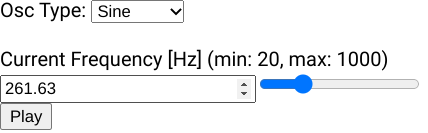
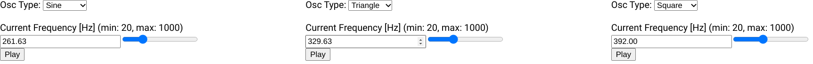
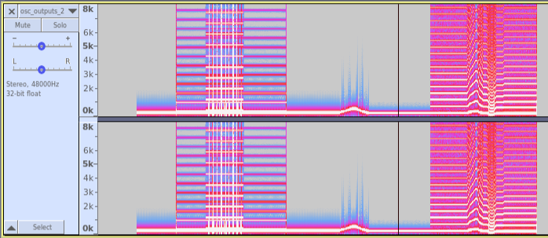

# Inter-React-ive Oscillator

First attempt at a react component using `webAudioAPI` to create an interactive Oscillator react component.

## Installation/Development

This project uses [pnpm](https://pnpm.io/) for package management.

- To install and run this package you will simply need `pnpm`

  - `npm i -g pnpm`

- For contribution and project setup see `Development Dependencies` below.

### Development Dependencies

In addition to the `devDependencies` in the `package.json` this project uses the following packages:

- [commitizen](https://commitizen-tools.github.io/commitizen/)
- [pre-commit](https://pre-commit.com/)

#### Install Script

These are both available on `pip` and `conda`... To manage the `cross-platform` dependencies an install script has been created:

- Make the script executable: `chmod u+x ./install.sh`
- Run the install script from the project root directory: `./install.sh`
- This script will:
  - Install/check all necessary dependencies and prerequisites from `pip`/`npm`.
  - Install the `pre-commit` hooks with `pre-commit`
  - Install the from the `project.json` file with `pnpm`
- If you would like to use `conda` or other package managers then a manual install is required.

The use of the `pip`/`Python` packages is simply as they are intended to be more 'cross-platform' than their `npm` counterparts.

**NOTE:** **_The install script has only been tested on `Linux`. However should work on macOS/possibly windows._**

## Screenshots

### Singular `InteractiveOscillator`

### Default `App.js`

### Example Spectrogram

## Sandbox (Easiest way to get an idea of the project)

- Try out the `inter-reactive-oscillator` is to try it in [this Sandbox](https://codesandbox.io/p/github/jordyjwilliams/inter-reactive-oscillator/main/)

## Available `pnpm` Scripts

For development and building:

- `pnpm start`: runs default app in development mode. Server will be started at http://localhost:3000.
  - By default 3 nested interactive oscillator objects will be generated in columns.
- `pnpm test`: launches the test runner _TODO_
- `pnpm test-coverage`: launches the test runner and reports coverage
- `pnpm run build`: Builds the app for production to a `build` directory.
  - Bundles React in production mode
  - Optimizes for the best performance.
  - Build minified, filenames include hashes.

## Notes

- This is still very much in a demo state
- Quick proof of concept/tutorial/teaching aid for myself.

## TODO

### UI

- Add CSS / make this look nice
- Osc/scope to view created waveform
  - More possibilities in `webAudioAPI`
- Fix clamping issues of freq and gain values
  - Remove all text boxes, use increment and decrement buttons

### Testing/CICD

- Add/fix tests
- Add CICD --> automated testing and branch rules

## Docs

- Improve documentation --> `jsdoc`, `better-docs`
